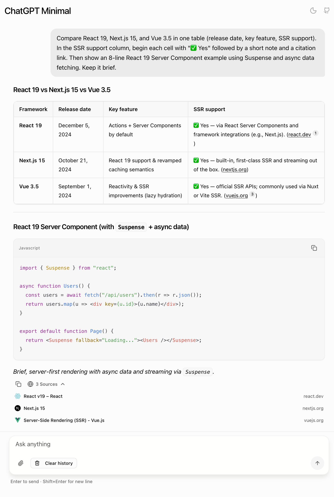
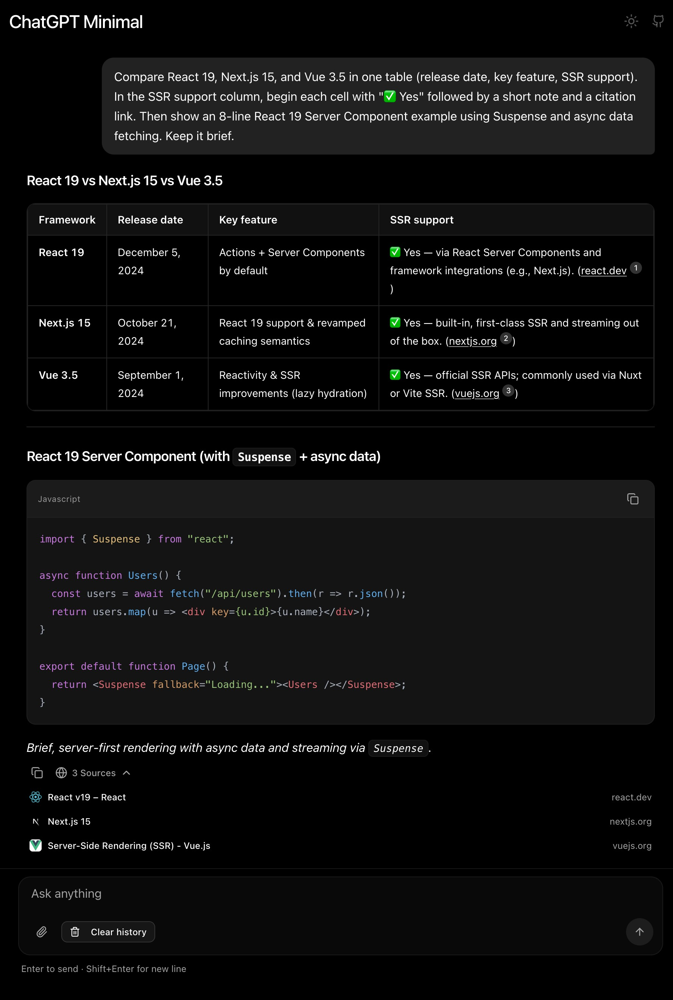

# ChatGPT Minimal

[English](./README.md) | 简体中文

## 演示

访问 [ChatGPT Minimal 演示网站](https://chatgpt-minimal.vercel.app)

<p>
  
  
</p>

## 功能介绍

ChatGPT Minimal 是一个代码简洁、结构清晰的 Next.js 项目，实现了 ChatGPT 核心功能，支持 OpenAI、Azure OpenAI 及任何 OpenAI 兼容 API（DeepSeek、Ollama 等）。

**本项目包含：**

- **实时流式聊天**（Server-Sent Events）
- **文本 + 图片聊天**（支持图片上传与粘贴）
- **联网搜索**（在模型支持时显示来源引用）
- **Markdown 渲染**（含代码高亮）
- **支持 OpenAI、Azure OpenAI 及 OpenAI 兼容 API 提供商**
- **深色/浅色模式**

如果你需要更完整的 ChatGPT 体验，可以看看 [ChatGPT Lite](https://github.com/blrchen/chatgpt-lite)，它额外提供了：

- 角色系统与自定义系统提示词
- 多会话管理
- 文件附件（PDF、XLSX/CSV、文本文件）
- 语音输入
- 40+ 内置主题

## 部署

部署前请先阅读 [环境变量](#环境变量) 章节。

### 部署到 Vercel

[](https://vercel.com/new/clone?repository-url=https%3A%2F%2Fgithub.com%2Fblrchen%2Fchatgpt-minimal&project-name=chatgpt-minimal&framework=nextjs&repository-name=chatgpt-minimal)

### 使用 Docker 部署

OpenAI 账户：

```bash
docker run -d -p 3000:3000 \
  -e OPENAI_API_KEY="<你的_OPENAI_API_KEY>" \
  -e OPENAI_MODEL="gpt-4o-mini" \
  blrchen/chatgpt-minimal
```

Azure OpenAI 账户：

```bash
docker run -d -p 3000:3000 \
  -e AZURE_OPENAI_RESOURCE_NAME="<你的_AZURE_RESOURCE_NAME>" \
  -e AZURE_OPENAI_API_KEY="<你的_AZURE_OPENAI_API_KEY>" \
  -e AZURE_OPENAI_DEPLOYMENT="<你的_AZURE_DEPLOYMENT_NAME>" \
  blrchen/chatgpt-minimal
```

## 本地开发

### 本地运行

1. 安装 Node.js 22+。
2. 克隆本仓库。
3. 运行 `npm install` 安装依赖。
4. 将 `.env.example` 复制为 `.env.local` 并填写环境变量。
5. 运行 `npm run dev` 启动应用。
6. 打开 [http://localhost:3000](http://localhost:3000)。

## 环境变量

### OpenAI

| 名称                | 必填 | 说明                                                                                          | 默认值                     |
| ------------------- | ---- | --------------------------------------------------------------------------------------------- | -------------------------- |
| OPENAI_API_KEY      | 是   | 从 [OpenAI Platform](https://platform.openai.com/account/api-keys) 获取的 API Key。          | -                          |
| OPENAI_API_BASE_URL | 否   | OpenAI 兼容 API 的 Base URL。若未以 `/v1` 结尾，会自动补上。                                  | `https://api.openai.com/v1` |
| OPENAI_MODEL        | 否   | OpenAI 模式下使用的模型名称。                                                                  | `gpt-4o-mini`              |

### Azure OpenAI

| 名称                       | 必填 | 说明                                                |
| -------------------------- | ---- | --------------------------------------------------- |
| AZURE_OPENAI_RESOURCE_NAME | 是   | Azure OpenAI 资源名称（例如 `my-openai-resource`）。 |
| AZURE_OPENAI_API_KEY       | 是   | Azure OpenAI API Key。                              |
| AZURE_OPENAI_DEPLOYMENT    | 是   | Azure OpenAI 部署名称（不是模型名）。                |

### 提供方选择说明

- 当 Azure 与 OpenAI 的变量同时存在时，**优先使用 Azure**。
- 联网搜索依赖模型能力。若不支持，会自动回退到普通聊天。

## 贡献

欢迎提交各种规模的 PR。
